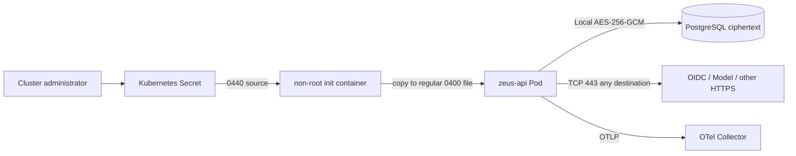

# Security Hardening Proposal: Bind secret delivery and outbound authority

## Decision

Zeus needs one production key-delivery design and one owner for outbound destination policy. The current repository can safely consume a protected file and deny unspecified Pod traffic, but the cloud-specific delivery and allowlists are unresolved.

## Executive Recommendation

We have two serious options. Option 1, **KMS-backed mounted key**, keeps AES-GCM in the process and uses workload identity plus an approved secret driver. Option 2, **direct KMS envelope encryption**, gives each stored secret a KMS-wrapped data key and removes the static master-key mount.

I recommend Option 1 for 0.1.0. It uses the boundary already implemented in `apps/zeus-api/src/config.rs`, leaves stored envelopes compatible, and lets the platform team select cloud components without adding a vendor SDK to the core service. Option 2 becomes preferable when reducing key residency outweighs KMS latency, quota, migration, and availability costs.

## Evidence

I inspected the active source and deployment files listed below. The strongest signal is the combination of a good application file seam and a deployment rule that must currently allow any TCP 443 destination.

| Evidence | Finding or document | What it establishes |
| --- | --- | --- |
| `E002` | [`docs/THREAT_MODEL.md`](../../../../THREAT_MODEL.md) — Secret and Capability threat model | Secret and outbound Capability authority share the API process boundary. |
| `E003` | `apps/zeus-api/src/config.rs` — protected key-file loader | The loader rejects symlinks, large files, empty files, and group or other permissions on Unix. |
| `E004` | `apps/zeus-api/src/crypto.rs` — `EnvelopeCipher` | AES-256-GCM is behind one trait, while its operations are synchronous and the stored envelope has no wrapped data key. |
| `E007` | `deploy/kubernetes/zeus.yaml` — Pod and network policy | A non-root init container stages the Secret source into a memory-backed regular `0400` file; default-deny is active; API HTTPS egress has no destination selector. |

The first three claims are observed in source. We infer from `E002` and `E007` that a compromised API process inherits a broad combination of decrypted secret access and outbound HTTPS reach. That inference does not prove an exploit. It identifies a privileged boundary where production controls can reduce impact.

## Current Design And Failure Mode

The Kubernetes baseline mounts `zeus-runtime/envelope-key` only into a non-root init container. The init container copies the group-readable Secret source into a memory `emptyDir`, changes it to a regular `0400` file owned by the API user, and the main container mounts only that staged volume. `AppConfig` reads it once and constructs `LocalEnvelopeCipher`. PostgreSQL stores ciphertext, nonce, and key id. NetworkPolicy blocks unspecified protocols and permits DNS, PostgreSQL, OTLP, and TCP 443. The 443 rule is broad because Kubernetes NetworkPolicy cannot express DNS destination policy and the project has no chosen egress gateway.

This design fails closed when the key file is missing or malformed. It does not establish where the Kubernetes Secret came from, how workload identity limits retrieval, who rotates it, or which HTTPS hosts are allowed. Those controls live outside the current repository.

## Desired Invariants

- Production key material enters the Pod only through an approved KMS-backed path.
- Key values never use environment variables and never enter logs, events, traces or API responses.
- An unrelated Pod cannot read the key or use Zeus outbound permissions.
- Provider, OIDC, KMS and telemetry requests traverse an observable destination policy.
- KMS or key-delivery failure causes a clear readiness or operation failure without plaintext fallback.
- Rotation keeps historical ciphertext readable until rewrap or retirement is complete.

## Constraints And Non-Goals

No cloud vendor is selected. We cannot write a truthful SecretProviderClass, workload identity annotation, KMS ARN or gateway policy yet. This proposal does not choose a vendor, move Zeus into multiple services, or add a user-code sandbox. No performance claim here is measured.

## Before Architecture

[`../diagrams/bind-secret-and-egress-authority-before.mmd`](../diagrams/bind-secret-and-egress-authority-before.mmd) shows the current authority flow. The API owns local decrypt and can reach any HTTPS destination. The design already has useful Pod hardening, so our change can stay focused on key origin and destination policy.

## Options

### Option 1: KMS-backed mounted key

The attractive part of this option is its narrow application change. A cloud secret driver uses workload identity to retrieve a KMS-protected source value. The staging init container copies that source into the regular file Zeus already validates. Local AES-GCM stays on the hot path. The egress gateway handles FQDN, SNI or service-identity policy that NetworkPolicy cannot represent.

The security gain comes from removing manual Secret population and ambient HTTPS reach from normal operations. Key plaintext still resides in the API process and on the mounted in-memory volume, so node, Pod-debug and process-compromise risks remain. We should keep Kubernetes administrative access tightly controlled and avoid treating the driver as a complete answer to runtime compromise.

Performance should remain close to the current encryption path because startup or rotation fetches the key while ordinary encrypt and decrypt stay local. A gateway can add connection and policy latency to model and OIDC calls. We need to measure that with the 200-Run workload, not assume it is negligible. The driver and gateway also add two platform dependencies, but neither changes the database envelope.

Rollout can start with one canary API Pod staging the same key id from the driver. The canary reads an existing encrypted Connection Secret and writes a test-only secret. Gateway policy begins in audit mode, then enforces the observed destination set. Rollback restores the prior source and policy while keeping ciphertext and key id unchanged. Key changes require a Pod rollout because the staged file is immutable for the Pod lifetime.

[`../diagrams/bind-secret-and-egress-authority-mounted-key-after.mmd`](../diagrams/bind-secret-and-egress-authority-mounted-key-after.mmd) keeps the local cipher and moves key origin plus destination policy to explicit platform components.

| Change | Before | After | Security consequence | Cost |
| --- | --- | --- | --- | --- |
| Key origin | Manually populated Kubernetes Secret | Workload identity and KMS-backed secret driver | Retrieval is bound to Pod identity and KMS policy | Driver, identity and rotation operations |
| Key transport | `0440` Secret source staged into a regular `0400` memory file | Driver source staged into the same regular `0400` memory file | Application retains strict file checks and does not follow volume symlinks | Key still exists in Pod memory; rotation needs a rollout |
| HTTPS policy | Any destination on TCP 443 | Gateway destination allowlist | Limits exfiltration and SSRF reach | Gateway latency and policy maintenance |
| Stored envelope | Ciphertext, nonce, key id | Unchanged | No data migration | Static master-key model remains |

### Option 2: Direct KMS envelope encryption

This option gives KMS a stronger role. Zeus generates or receives a data key for each secret, encrypts locally, and stores the KMS-wrapped data key with ciphertext. Workload identity and tenant-bound encryption context authorize unwrap. The Pod no longer mounts a static master key.

Its strongest case is reduced key residency and richer KMS audit. A database snapshot and Kubernetes Secret access no longer provide the master key. A compromised API can still invoke KMS while its workload identity is valid, so KMS policy, encryption context, egress and anomaly detection remain critical. Per-Organization keys may improve isolation but can create large policy and quota surfaces; one shared key with tenant context lowers operations cost but concentrates trust.

What gives me pause is the reliability shape. `EnvelopeCipher` is synchronous, while every serious KMS SDK is networked and asynchronous. Cold reads add latency and consume quota. A plaintext data-key cache can protect latency and availability, but it reintroduces key lifetime in memory and needs strict bounds, zeroization, eviction and metrics. KMS throttling can block OIDC secret reads, model credentials and enterprise Capability connections at the same time.

Migration also touches stored data. The current envelope has ciphertext, nonce and key id, with no encrypted data key or format version. We would need a forward migration, dual-read, new-format writes, a background rewrap process, checksums and a long rollback window. This work is reasonable after the cloud and SLO are fixed; doing it provider-neutrally now would create an abstraction with unknown quota, context and error semantics.

[`../diagrams/bind-secret-and-egress-authority-direct-kms-after.mmd`](../diagrams/bind-secret-and-egress-authority-direct-kms-after.mmd) shows the new KMS request path and the encrypted data key stored with each secret.

| Change | Before | After | Security consequence | Cost |
| --- | --- | --- | --- | --- |
| Master key | Static key in Pod | KMS-held key | Removes long-lived mounted master key | KMS becomes an online dependency |
| Envelope | Ciphertext, nonce, key id | Versioned envelope with wrapped data key and context | Snapshot needs KMS authorization to decrypt | Schema and data migration |
| Crypto API | Synchronous local trait | Async KMS-backed service | Central KMS policy and audit | SDK, retries, quotas and failure mapping |
| HTTPS policy | Any destination on TCP 443 | KMS plus Provider allowlists through gateway | Narrows outbound authority | More routes and incident dependencies |

## Comparison

Both options need workload identity and controlled egress. The decision turns on whether removing the static key justifies a new online dependency and data migration.

| Dimension | Option 1: mounted key | Option 2: direct KMS |
| --- | --- | --- |
| Security | Narrows key origin and destinations; key remains in Pod | Removes static master key; KMS invocation remains available to the Pod |
| Performance | Local crypto; gateway overhead only | KMS cold-path latency and quota; cache policy may be needed |
| Memory | Current key and cipher state | SDK pools and optional data-key cache; exact impact unknown |
| Reliability | Driver and gateway affect startup and egress | KMS affects secret read/write during runtime |
| Operability | Cloud overlay, rotation and gateway rules | Adds KMS SDK, context policy, quotas and envelope migration |
| Migration | No database change | Dual-read, new-write, rewrap and rollback window |

Option 1 preserves the current fast path and gives us a reversible production step. Option 2 gives a stronger key boundary, but its latency, quota and outage behavior need actual cloud measurements before we can set safe cache and retry rules.

## Recommendation

I recommend Option 1 for Zeus 0.1.0 under the current provider-neutral constraint. We should complete the cloud overlay, gateway policy and rotation exercise before calling H production-ready. We should reopen Option 2 if policy forbids a Pod-mounted master key, if Organization-specific KMS isolation is mandatory, or if measured KMS latency and availability fit the service SLO without an unsafe cache.

## Evidence Coverage And Residual Risk

| Evidence | Option 1 | Option 2 | Residual risk |
| --- | --- | --- | --- |
| `E002` — Secret and Capability threat model | Mitigates | Mitigates | Compromised API keeps necessary remote authority |
| `E003` — protected key-file loader | Uses directly | Replaces after migration | Option 1 key remains in Pod |
| `E004` — `EnvelopeCipher` | Preserves implementation | Requires async redesign | Provider errors and context policy need stable mapping |
| `E007` — Pod and network policy | Requires cloud allowlist overlay | Requires KMS and Provider allowlist overlay | Misconfiguration can block service or permit an unintended host |

Direct tactical protections remain required in both options: non-root Pod, read-only root filesystem, no ServiceAccount token automount, protected key file where used, default-deny NetworkPolicy, secret-safe telemetry and destination tests.

## Migration And Rollout

For Option 1, platform owners select the driver and identity mapping, mount the existing key into a canary, and verify old plus new envelopes. Gateway policy runs in audit mode against a non-customer environment, then blocks unapproved destinations. Rotation introduces a new key id only after every Pod can read the new value; old key material stays available until historical envelopes have been handled under a written retirement procedure.

For Option 2, we would keep the Option 1 reader during migration. New rows use a versioned KMS envelope, old rows continue to use the mounted key, and a bounded rewrap job moves records. Rollback stops new-format writes and leaves both readers available. Removing the old reader happens in a later release after restore testing.

## Validation Plan

- Reject missing, symlinked, oversized and group-readable final key files in unit and deployment tests.
- Prove that an unrelated Pod cannot read the key or assume the Zeus workload identity.
- Deny an unapproved HTTPS destination and retain gateway audit evidence.
- Rotate the key during active traffic and verify existing Connection and OIDC secrets.
- Inject Secret driver, KMS, DNS, gateway and Collector failures; verify readiness, stable errors and lease recovery.
- Run `scripts/load/capacity.mjs` for 30 minutes at 200 concurrent Runs and compare queue, Provider and gateway latency.
- Restore PostgreSQL into an isolated environment and prove that the retained key path can decrypt required records.

## Implementation Work Packages

- Application: keep `ZEUS_ENVELOPE_KEY_FILE` exclusive with inline keys and preserve strict file checks.
- Deployment: add a cloud-owned SecretProviderClass or equivalent, workload identity and egress-gateway overlay.
- Operations: add key rotation, KMS denial and gateway denial exercises to release evidence.
- Observability: alert on key-load failure, KMS denial or throttling, egress denial, queue depth and Provider failure.
- Future direct KMS work: version the envelope, make crypto calls async, define context, dual-read and rewrap only after cloud selection.

## Open Questions

- Which cloud, KMS, driver, workload identity and egress gateway will be used?
- Does policy require one key per Organization, per environment, or a shared key with encryption context?
- What KMS outage window and cold-decrypt p95 can Zeus accept?
- Who owns destination changes when a Workspace adds a new model or enterprise Capability?
