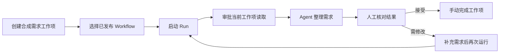

# WorkItem、Workflow 与 Run 展示建议

状态：页面分层和人工验收已实现，2026-09-16。BPM 编排仍为后续建议。

## 当前环境示例

3000 日常环境，Workspace：云帆优品测试工作空间。新增独立资源，保留原有 Agent、Workflow 和组织模型配置。

- Agent：[需求整理与人工确认 · 示例](http://127.0.0.1:3000/01a05684-46da-7a1d-843f-13bd5c6c4c45/agents?selected=01a0a5fc-0f75-7211-94b9-12458c1ba0dc)，版本 1 已发布。
- Workflow：[需求整理 → 人工确认 · 示例](http://127.0.0.1:3000/01a05684-46da-7a1d-843f-13bd5c6c4c45/workflows?selected=01a0a5fc-5c16-71cf-b45c-f98aa78f0457)，版本 1 已发布。
- WorkItem：[订单 CSV 导出需求整理](http://127.0.0.1:3000/01a05684-46da-7a1d-843f-13bd5c6c4c45/work-items/01a0a5fc-b4be-7e6d-824c-ebc5f40dd30b)，合成数据，状态为 `in_progress`。
- Run：[首次演示运行](http://127.0.0.1:3000/01a05684-46da-7a1d-843f-13bd5c6c4c45/runs/01a0a5fc-d148-79f2-83a6-f805341ea9a4)。审批和当前工作项读取成功，后续模型请求返回 HTTP 400，终态为 `failed`，错误码 `model_request_rejected`，没有最终回答。

Workflow 使用现有组织模型，只允许需要审批的当前工作项读取工具；最多 8 步、120 秒、4000 Token。Token 预算不等于供应商账单硬上限。人工确认发生在 Run 之后，不是此 Workflow 中已实现的自动节点。

该示例尚未完成成功回答和人工接受。首次演示时没有评论或验收入口；此次改造已增加独立人工验收入口，但仍需先获得成功 Run 的结果，不能声称该示例业务闭环已贯通。

只读检查发现引用模型没有 `thinking` 配置；当前模型适配器不回传 `reasoning_content`。DeepSeek 官方说明默认启用思考模式，带工具的后续请求缺少该字段会返回 400。因此思考模式兼容是本次失败的高可能原因，尚无供应商具体拒绝正文证明。当前模型表单没有思考模式设置项。

## 展示归属

| 对象 | 推荐展示 | 所回答的问题 |
| --- | --- | --- |
| WorkItem | 业务状态、负责人、结果与人工确认；需要时增加轻量阶段视图 | 这件事到哪里了，下一步由谁处理？ |
| Workflow | 已发布版本的配置摘要、Agent、工具、审批策略和预算；未来有真实节点模型后再提供编排图 | 允许 Agent 如何处理任务？ |
| Run | 类似 GitHub Actions 的实际执行步骤、状态、耗时和可展开事件 | 本次实际执行了什么，哪里失败？ |

完整 BPM 涉及流程定义和实例语义，不能只通过将 WorkItem 画成节点图实现。当前 WorkflowVersionSpec 没有 jobs、steps、条件边和节点恢复模型，不展示为已具备这些能力。

## 示例业务流程

以下是业务操作建议，包含人工动作，不是当前 Runtime 可执行的 BPM 定义。

业务状态以现有 `open`、`in_progress`、`blocked`、`completed`、`canceled` 为准。待人工确认不能伪装为已持久化的独立状态；业务完成也不能从 Run 成功自动推导。

## Run 页面改进

上方显示工作项、Workflow 版本、运行状态和最终结果。步骤区从持久事件推导，支持重复模型调用、多个工具调用及审批等待；展开后查看脱敏详情。保留原始事件入口。

- `experience.selection_completed` 已精确显示“经验选择完成”，避免将中间事件误标为“运行完成”。
- `model.completed` 只结束一次模型请求，`tool.result` 只结束对应工具，只有 Run 自身终态表示运行结束。
- 审批恢复产生的第二次 attempt 不应无说明地展示为失败重试；人工重试会创建另一个 Run。
- SSE 断线时保留已有步骤并标明连接状态，不推断后续成功。
- WorkItem 结果页已优先呈现正文，原始 JSON 折叠。

## 后续实施顺序

1. 补齐可配置的非思考模式或正式支持思考模式工具往返；优先使用独立模型配置验证，避免影响组织现有 Agent。成功复验后再进入人工确认。
2. 已实现：人工接受/需修改的持久化记录和页面入口，绑定本次 Run 与执行版本，与工具授权审批分离。
3. 已实现：现有持久事件的折叠执行视图与精确事件标签，保留 SSE、取消、恢复与失败事实。
4. 已实现：WorkItem 业务进度与相关运行导航；Workflow 已发布配置摘要。
5. 只有实际业务需要跨角色、条件分支、并行或长时间业务等待时，再设计 BPM 流程定义与实例执行能力。

参考：[GitHub 运行可视化](https://docs.github.com/en/actions/how-tos/monitor-workflows/use-the-visualization-graph)、[DeepSeek 思考模式工具调用要求](https://api-docs.deepseek.com/guides/thinking_mode/)。借鉴展示方式不代表 Zeus 已支持 GitHub Actions 的 jobs/steps 语义。

## 页面实现增量

已增加结果优先的 WorkItem 页面与人工验收表单、追加式验收 API/迁移、Workflow 已发布配置概览、Run 审批前置与可折叠技术详情。历史示例失败记录保留，上述“没有评论入口”是首次演示时的发现；当前新增的是独立验收记录入口，并非通用评论系统。模型兼容问题不在此次页面改造范围。

验证：前端 148 项测试、Rust workspace 测试与 Clippy、9 组隔离 PostgreSQL 测试通过；镜像构建成功并部署至 3000，应用迁移 0032。恢复登录后完成实际浏览器复验：Run 事件默认折叠且可展开，事件标签区分中间完成与运行终态；失败无输出的工作项无可提交验收表单；在既有合成工作项“页面验收：团队周报需求分析”保存一条明确标注界面联调验证的“需要修改”记录，刷新后仍可见，工作项保持 Open。检查了桌面 Workflow 配置概览和 390px 窄屏验收表单，无横向溢出，检查期间控制台无警告或错误。以上不代表真实模型业务质量或生产验收通过。
